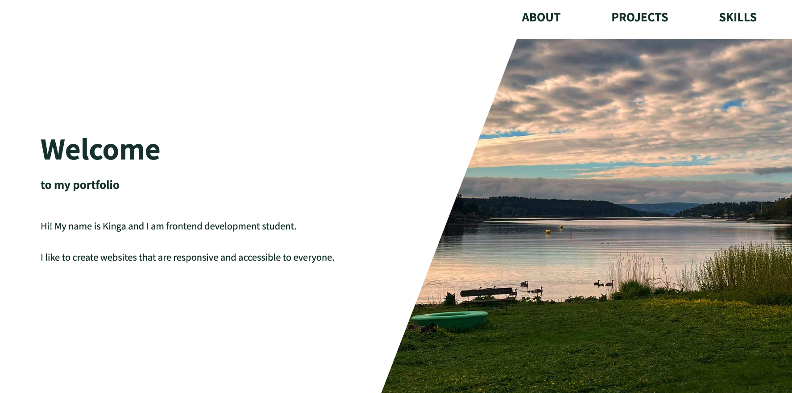
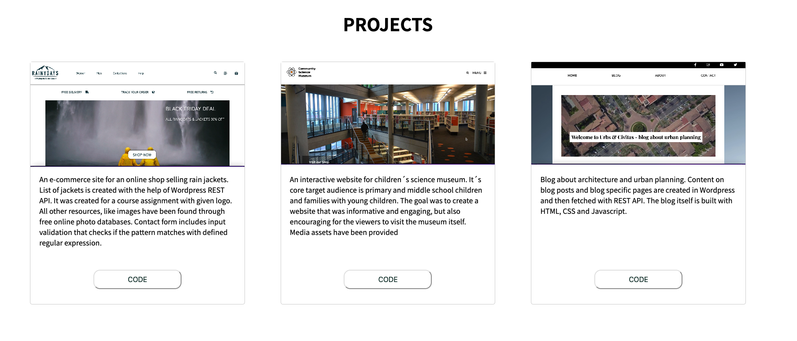

# Kinga Kot | Portfolio

<div id="images">


</div>

This is my portoflio containg all the projects I have built during my first year of front-end development study.

## Description
One page portfolio site that contains 3 biggest projects I have built during my first year of studies. It also includes information about my skills in programming, design and other relevant skills that are important to work as a frontend developer.

## Built With

- HTML5
- CSS
- Javascript

## Getting Started
Project can be accessed through following repository:

```
gh repo clone Kinga89/portfolio-1
```

---

<div id="social" align="center">
<a href="https://www.linkedin.com/in/kinga-kot-3a4b8a149/">
  
 </a>
  <a href="kotkiga89@gmail.com">
  
 </a>
</div>

<div align="center">
  
</div>
